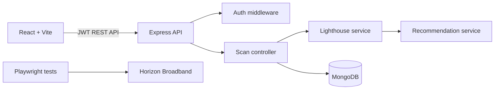

# Lighthouse Monitor

A MERN application for authenticated website performance monitoring. It runs a real backend Lighthouse analysis, turns audit data into prioritized recommendations, and retains per-user scan history.

## Features

- Secure registration, login, and session restoration with JWTs
- Server-side Lighthouse scans of public HTTP(S) targets
- SSRF-aware URL validation before a browser is launched
- Performance, accessibility, best-practices, SEO, PWA, and Core Web Vitals reporting
- Actionable, severity-ranked recommendations rather than raw audit output
- Private scan history, scan reports, retry, and deletion
- Horizon Broadband login automation with Playwright and environment-held credentials
- Unit, API, and browser-test foundations

## Architecture



See [architecture documentation](docs/architecture.md) for the component responsibilities and security model.

## Requirements

- Node.js 20+
- MongoDB 7+ (or a compatible hosted MongoDB deployment)
- Google Chrome/Chromium available to the server process for Lighthouse

## Setup

```bash
git clone <repository-url>
cd lighthouse-monitor
cp .env.example .env
npm install
```

Populate `MONGO_URI` and replace `JWT_SECRET` with a long random value. Set Horizon credentials only in your local `.env`; never commit them.

## Run

```bash
npm run dev
```

The React application runs at `http://localhost:5173`; the API runs at `http://localhost:5000`.

## Test

```bash
npm test
npm run test:e2e
```

The browser suite skips credentialed Horizon login success coverage when `HORIZON_USERNAME` and `HORIZON_PASSWORD` are not configured. The test still validates page structure and client-side form validation.

## API

| Method | Endpoint | Purpose |
| --- | --- | --- |
| POST | `/api/auth/register` | Create a Monitor account |
| POST | `/api/auth/login` | Authenticate and receive a token |
| GET | `/api/auth/me` | Get the current user |
| POST | `/api/scans` | Start a Lighthouse scan |
| GET | `/api/scans` | List the current user's scans |
| GET | `/api/scans/:id` | Get an owned scan report |
| POST | `/api/scans/:id/retry` | Re-run an owned scan |
| DELETE | `/api/scans/:id` | Delete an owned scan |

## Security considerations

Scanning user-provided URLs can be used for server-side request forgery. The API only accepts `http:` and `https:` URL schemes and blocks localhost, loopback, private, link-local, and cloud-metadata-style addresses before launching Lighthouse. This is defense in depth, not a substitute for deploying the scanner in a network-isolated environment with egress controls. Authentication, rate limiting, Helmet, CORS allowlisting, input validation, bcrypt password hashing, and generic production errors are included.

## Known limitations

- Lighthouse needs a Chrome-compatible browser on the API host and target sites can block automation.
- Each scan is executed asynchronously in the application process; production scale should move jobs into a queue and a dedicated, sandboxed worker pool.
- Network DNS resolution can change after validation. Egress network policy is the final SSRF control.

